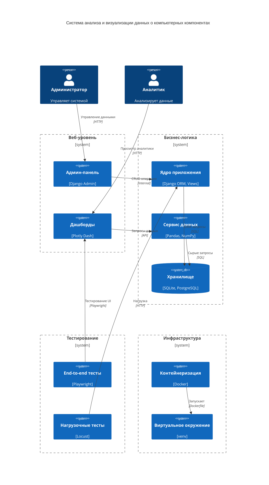

## Краткие указания:
# активация venv
`source ./venv/bin/activate`
# установка зависимостей
`pip install -r requirements.txt`
# запуск тестирования (c активированным, который в папке playwright)
`pytest test.py`
# запуск locust (c активированным venv, который в папке locust)
`locust -f locust.py`

## Руководство оператора:
## **1. Назначение и область применения**  

### **1.1 Назначение документа**  
Настоящий документ является руководством оператора для работы с проектом «Система анализа и визуализации данных о компьютерных компонентах». Руководство описывает порядок установки, настройки окружения и запуска компонентов системы.  

### **1.2 Область применения**  
Руководство предназначено для разработчиков, тестировщиков и администраторов, которым необходимо развернуть и протестировать проект в рабочей среде.  

## **2. Указания оператору**  

### **2.1 Требования к среде исполнения**  
Перед запуском проекта необходимо установить следующие программные средства:  

- **Docker и Docker Compose** – для управления контейнерами  
- **Python** (совместимая версия) – для работы с тестовыми инструментами  
- **Playwright** – для автоматизированного тестирования UI  
- **Locust** – для нагрузочного тестирования  
- Установленные зависимости из `requirements.txt`  

### **2.2 Подготовка к работе**  

Перед запуском системы необходимо развернуть контейнеры и подготовить тестовое окружение.  

#### **2.2.1 Запуск контейнеров**  
Откройте терминал и выполните команды:  

```sh
cd /workspaces/codespaces-blank/project_practice
docker-compose up
```

После выполнения команда `docker-compose up` развернет все необходимые сервисы в контейнерах.  

#### **2.2.2 Настройка окружения для Playwright**  
Для работы Playwright необходимо создать виртуальное окружение, установить зависимости и загрузить необходимые компоненты:  

```sh
cd /workspaces/codespaces-blank/project_practice/playwright/
python -m venv venv 
source venv/bin/activate
pip install -r requirements.txt
playwright install
```

После успешного выполнения этих команд среда Playwright будет настроена.  

#### **2.2.3 Запуск тестов Playwright**  
Для запуска тестов Playwright выполните команду:  

```sh
pytest test.py -v
```

#### **2.2.4 Настройка окружения для Locust**  
Аналогично настройке Playwright создайте виртуальное окружение и установите зависимости:  

```sh
cd /workspaces/codespaces-blank/project_practice/locust/
python -m venv venv 
source venv/bin/activate
pip install -r requirements.txt
```

#### **2.2.5 Запуск тестов Locust**  
Запустите нагрузочное тестирование с помощью команды:  

```sh
locust -f locust.py
```

Эта команда развернет веб-интерфейс Locust, доступный по адресу `http://localhost:8089`, где можно задать параметры нагрузки и запустить тестирование.  

## **3. Контроль функционирования**  

### **3.1 Проверка состояния контейнеров**  
Для проверки запущенных контейнеров используйте команду:  

```sh
docker ps
```

Если какой-либо контейнер не работает, можно перезапустить его с помощью:  

```sh
docker restart <container_id>
```

### **3.2 Проверка логов**  
Для анализа возможных ошибок используйте команды:  

- **Логи Docker**:  
  ```sh
  docker-compose logs -f
  ```
- **Логи Playwright** (если тесты не проходят):  
  ```sh
  pytest test.py --capture=no
  ```
- **Логи Locust** (если нагрузочное тестирование не выполняется корректно):  
  ```sh
  cat locust.log
  ```

## **4. Завершение работы**  

### **4.1 Остановка контейнеров**  
Для остановки всех запущенных контейнеров выполните:  

```sh
docker-compose down
```

### **4.2 Выход из виртуального окружения**  
Для выхода из виртуального окружения Playwright или Locust используйте команду:  

```sh
deactivate
```

## **5. Действия в нестандартных ситуациях**  

| **Проблема** | **Возможная причина** | **Способ устранения** |  
|-------------|----------------------|----------------------|  
| Контейнеры не запускаются | Заняты порты, отсутствуют зависимости | Освободите порты, выполните `docker-compose up --build` |  
| Playwright не запускает тесты | Не установлен Playwright | Выполните `playwright install` и `playwright install-deps` |  
| Locust не запускается | Ошибка установки зависимостей | Перепроверьте `requirements.txt`, повторите `pip install -r requirements.txt` |  
| Docker не видит сеть | Проблемы с Docker Compose | Выполните `docker network prune`, затем `docker-compose up` |  

## **6. Источники и ссылки**  
- **Docker**: [https://www.docker.com/](https://www.docker.com)  
- **Playwright**: [https://playwright.dev/python/](https://playwright.dev/python/)  
- **Locust**: [https://locust.io/](https://locust.io/)  
- **Python**: [https://www.python.org/](https://www.python.org/)  


